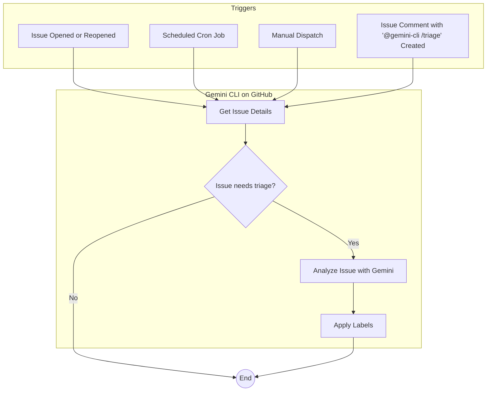

# Issue Triage Workflows

This document describes a comprehensive system for triaging GitHub issues using the Gemini CLI GitHub Action. This system consists of two complementary workflows: a real-time triage workflow and a scheduled triage workflow.

- [Issue Triage Workflows](#issue-triage-workflows)
  - [How it Works](#how-it-works)
  - [Implementation](#implementation)
  - [Workflows in Detail](#workflows-in-detail)
    - [Real-Time Issue Triage](#real-time-issue-triage)
    - [Scheduled Issue Triage](#scheduled-issue-triage)
  - [Issue Deduplication](#issue-deduplication)
    - [Overview](#overview)
    - [How it Works](#how-it-works-1)
    - [Setup](#setup)


## How it Works



The two workflows work together to ensure that all new and existing issues are triaged in a timely manner.

1. **Real-Time Triage**: When a new issue is opened or reopened, an issue comment that contains `@gemini-cli /triage` is created or when a maintainer of the repo dispatch the triage event, a GitHub Actions workflow is triggered. This workflow uses the Gemini CLI to analyze the issue and apply the most appropriate labels. This provides immediate feedback and categorization of new issues.

2.  **Scheduled Triage**: To catch any issues that might have been missed by the real-time triage, a scheduled workflow runs every hour. This workflow specifically looks for issues that have no labels or have the `status/needs-triage` label. This ensures that all issues are eventually triaged.

## Implementation

To implement this issue triage system in your repository, you will need to do the following:

1.  **Create the Workflow Files**: Create the necessary directories and download the example workflow files into `.github/workflows` directory in your repository.

```bash
mkdir -p .github/workflows
curl -o .github/workflows/gemini-issue-automated-triage.yml https://raw.githubusercontent.com/google-github-actions/run-gemini-cli/main/workflows/issue-triage/gemini-issue-automated-triage.yml
curl -o .github/workflows/gemini-issue-scheduled-triage.yml https://raw.githubusercontent.com/google-github-actions/run-gemini-cli/main/workflows/issue-triage/gemini-issue-scheduled-triage.yml
```

Alternatively, you can manually copy the contents of the workflow files from this repository into the corresponding files in your own repository.

2.  **Configure Secrets**: The workflows require secrets for authentication. You will need to create the following secrets in your repository's settings:

    *   `APP_ID`: The ID of your GitHub App.
    *   `APP_PRIVATE_KEY`: The private key of your GitHub App.
    *   `GEMINI_API_KEY`: Your API key for the Gemini API.

3.  **Customize (Optional)**: You can customize the prompts and settings in the workflow files to suit your specific needs. For example, you can change the triage logic, the labels that are applied, or the schedule of the scheduled triage.

## Workflows in Detail

### Real-Time Issue Triage

This workflow is defined in `workflows/issue-triage/gemini-issue-automated-triage.yml` and is triggered when an issue is opened or reopened. It uses the Gemini CLI to analyze the issue and apply relevant labels.

### Scheduled Issue Triage

This workflow is defined in `workflows/issue-triage/gemini-issue-scheduled-triage.yml` and runs on a schedule (e.g., every hour). It finds any issues that have no labels or have the `status/needs-triage` label and then uses the Gemini CLI to triage them. This workflow can also be manually triggered.

## Issue Deduplication

### Overview

The issue triage system includes an advanced feature for detecting and reporting duplicate issues. This system uses a custom MCP server backed by an AlloyDB database to store issue embeddings and find similarities between them.

### How it Works

The deduplication process involves two key workflows:

1.  **Real-time Duplicate Detection**: When a new issue is created, the `deduplicate-issues` job in the `gemini-issue-automated-triage.yml` workflow is triggered. This job uses the `duplicates` tool from the MCP server to find semantically similar issues. If any potential duplicates are found, the workflow will post a comment on the new issue listing the possible duplicates. This job can also be triggered manually by commenting `@gemini-cli /deduplicate` on an issue.

2.  **Scheduled Embedding Refresh**: To keep the database of issue embeddings current, the `refresh-embeddings` job in the `gemini-issue-scheduled-triage.yml` workflow runs on a schedule. This job uses the `refresh` tool of the MCP server to process all open issues and update their corresponding embeddings in the AlloyDB database.

### Setup

Setting up the issue deduplication feature requires a Google Cloud project and an AlloyDB database.

For detailed instructions on how to set up the necessary cloud resources and configure the workflows, please refer to the guide at [scripts/issue-deduplication/README.md](../../scripts/issue-deduplication/README.md). This guide provides step-by-step instructions for using the `setup_alloydb.sh` script and configuring the necessary secrets and variables in your GitHub repository.
